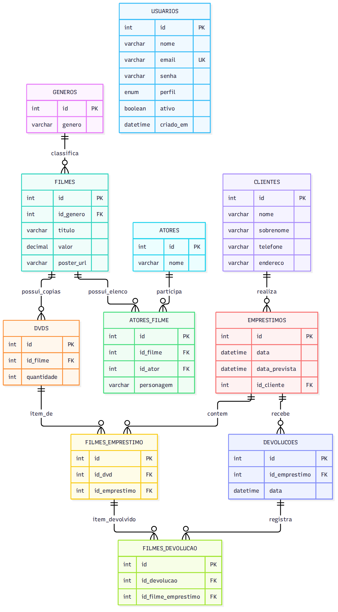

# Relatório de Modelagem, Integração e Defesa — Locadora LoucaWeb

**Projeto:** Sistema de Gerenciamento e Controle de Locação para Vídeo Locadora  
**Banco de dados:** MySQL / MariaDB — schema `locadora`  
**Backend:** PHP 8.0+ (Nativo, POO/PDO)  
**Integração externa:** TMDB (The Movie Database) — API REST  
**Data:** Outubro de 2026

---

## 1. Modelo Conceitual (DER) — Peso: 25%

O Diagrama Entidade-Relacionamento abaixo apresenta as entidades do sistema, seus atributos principais e as cardinalidades derivadas das chaves estrangeiras do DDL. A notação utilizada segue o padrão crow's foot: `||` indica exatamente um e `o{` indica zero ou muitos.

<div align="center">
  
</div>

> Fonte editável disponível em [image/DER_locadora.mmd](image/DER_locadora.mmd) (formato Mermaid).

### 1.1 Leitura das Cardinalidades

| Relação | Cardinalidade | Justificativa |
|---|---|---|
| **Gênero → Filme** | 1:N | Cada filme pertence a exatamente um gênero; um gênero pode classificar zero ou vários filmes. |
| **Filme → DVD** | 1:N | Cada registro de estoque aponta para um filme; um filme pode ter vários registros de DVD (cada um com `quantidade` de cópias). |
| **Filme ↔ Ator** | N:M | Resolvido pela entidade associativa `atores_filme`. O atributo `personagem` pertence à **participação** (relação), não ao ator isoladamente. |
| **Cliente → Empréstimo** | 1:N | Cada empréstimo pertence a exatamente um cliente; o cliente pode ter zero ou vários empréstimos. |
| **Empréstimo ↔ DVD** | N:M | Resolvido por `filmes_emprestimo` — representa os itens do empréstimo. |
| **Empréstimo → Devolução** | 1:N | Uma devolução pertence a um empréstimo. O DDL permite devoluções parciais (vários registros). |
| **Devolução ↔ Item Emprestado** | N:M | `filmes_devolucao` vincula devoluções a itens de `filmes_emprestimo`, permitindo devolver itens em momentos diferentes. |

### 1.2 Entidades e Atributos

| Entidade | Atributos Principais | Tipo de PK |
|---|---|---|
| `generos` | id, genero | Auto-increment |
| `filmes` | id, id_genero (FK), titulo, valor, poster_url | Auto-increment |
| `atores` | id, nome | Auto-increment |
| `atores_filme` | id, id_filme (FK), id_ator (FK), personagem | Auto-increment |
| `dvds` | id, id_filme (FK), quantidade | Auto-increment |
| `clientes` | id, nome, sobrenome, telefone, endereco | Auto-increment |
| `emprestimos` | id, data, data_prevista, id_cliente (FK) | Auto-increment |
| `filmes_emprestimo` | id, id_dvd (FK), id_emprestimo (FK) | Auto-increment |
| `devolucoes` | id, id_emprestimo (FK), data | Auto-increment |
| `filmes_devolucao` | id, id_devolucao (FK), id_filme_emprestimo (FK) | Auto-increment |
| `usuarios` | id, nome, email (UNIQUE), senha, perfil, ativo, criado_em | Auto-increment |

---

## 2. Modelo Lógico e DDL SQL — Peso: 25%

O modelo relacional está implementado em [database/locadora.sql](database/locadora.sql). Todas as tabelas utilizam **InnoDB** (suporte a transações e integridade referencial) e chaves primárias inteiras com `AUTO_INCREMENT`.

### 2.1 Tabela de Mapeamento Relacional

| Relação | Atributos e Tipos | Chaves e Restrições |
|---|---|---|
| `generos` | `id INT`, `genero VARCHAR(45)` | PK `id` |
| `filmes` | `id INT`, `id_genero INT`, `titulo VARCHAR(100)`, `valor DECIMAL(8,2)`, `poster_url VARCHAR(255) NULL` | PK `id`; FK `id_genero` → `generos.id` |
| `atores` | `id INT`, `nome VARCHAR(100)` | PK `id` |
| `atores_filme` | `id INT`, `id_filme INT`, `id_ator INT`, `personagem VARCHAR(100)` | PK `id`; FKs → `filmes.id`, `atores.id` |
| `dvds` | `id INT`, `id_filme INT`, `quantidade INT` | PK `id`; FK `id_filme` → `filmes.id` |
| `clientes` | `id INT`, `nome VARCHAR(45)`, `sobrenome VARCHAR(45)`, `telefone VARCHAR(20)`, `endereco VARCHAR(100)` | PK `id` |
| `emprestimos` | `id INT`, `data DATETIME`, `data_prevista DATETIME NULL`, `id_cliente INT` | PK `id`; FK `id_cliente` → `clientes.id` |
| `filmes_emprestimo` | `id INT`, `id_dvd INT`, `id_emprestimo INT` | PK `id`; FKs → `dvds.id`, `emprestimos.id` |
| `devolucoes` | `id INT`, `id_emprestimo INT`, `data DATETIME` | PK `id`; FK → `emprestimos.id` |
| `filmes_devolucao` | `id INT`, `id_devolucao INT`, `id_filme_emprestimo INT` | PK `id`; FKs → `devolucoes.id`, `filmes_emprestimo.id` |
| `usuarios` | `id INT`, `nome VARCHAR(100)`, `email VARCHAR(100) UNIQUE`, `senha VARCHAR(255)`, `perfil ENUM('funcionario','administrador')`, `ativo TINYINT(1)`, `criado_em DATETIME` | PK `id`; UNIQUE `email` |

### 2.2 Decisões de Tipos de Dados

| Decisão | Justificativa |
|---|---|
| `DECIMAL(8,2)` para `valor` | Evita erros de arredondamento do ponto flutuante em valores monetários. |
| `DATETIME` para datas | Registra data e hora exatas dos eventos (empréstimo, devolução). |
| `VARCHAR(20)` para `telefone` | Preserva zeros à esquerda e caracteres especiais como `+55`, `(11)`, `-`. |
| `VARCHAR(255)` para `senha` | Compatível com hashes `bcrypt` (gerados por `password_hash()`). |
| `ON DELETE NO ACTION` em todas as FKs | Impede exclusão em cascata acidental; a exclusão segue ordem programática no PHP. |

### 2.3 Mapeamento das Relações

As relações 1:N são implementadas pela FK no lado N. As relações N:M são decompostas em duas relações 1:N por tabelas associativas:

- **Filme ↔ Ator:** `atores_filme` (com atributo `personagem`)
- **Empréstimo ↔ DVD:** `filmes_emprestimo` (itens do empréstimo)
- **Devolução ↔ Item:** `filmes_devolucao` (itens devolvidos)

---

## 3. Backend PHP e Integração com API — Peso: 30%

### 3.1 Arquitetura do Backend

O sistema segue uma arquitetura em camadas sem framework:

```
public/index.php          → Front Controller (roteamento)
src/Controllers/*.php     → Regras de negócio e validações
src/Models/*.php          → Acesso ao banco de dados (PDO)
src/Services/*.php        → Integrações externas (TMDB)
templates/*.php           → Interface (HTML + PHP)
config/*.php              → Conexão e variáveis de ambiente
```

**Padrões técnicos aplicados:**
- **Prepared Statements (PDO):** todas as queries usam parâmetros vinculados, prevenindo SQL Injection
- **Transações ACID:** operações críticas (empréstimos, carga de dados) são atômicas
- **Sessões PHP:** autenticação e controle de acesso por perfil
- **cURL:** consumo da API TMDB com validação de status HTTP

### 3.2 Script de Carga Inicial — `seeder_api.php`

A integração está implementada na classe `SeederFilmesAPI` ([seeder_api.php](seeder_api.php)), que utiliza PDO para persistência e cURL para consumir os endpoints REST do TMDB.

#### Fluxo de Execução

```
1. Importa gêneros (/genre/movie/list)
   ↓ Mapa: ID_TMDB → ID_Local
2. Percorre filmes populares (/movie/popular)
   ↓ Paginação automática (20 filmes/página)
3. Para cada filme, busca elenco (/movie/{id}/credits)
   ↓ Limita aos 10 primeiros atores
4. TRANSAÇÃO: Insere filme + elenco + estoque (1-5 cópias)
   ↓ Commit ou Rollback
5. Repete até atingir ~2.000 DVDs
```

#### Endpoints Consumidos

| Endpoint TMDB | Dados Extraídos | Tabela Destino |
|---|---|---|
| `/genre/movie/list` | ID e nome do gênero | `generos` |
| `/movie/popular` | Título, gênero, pôster | `filmes` |
| `/movie/{id}/credits` | Nome do ator, personagem | `atores`, `atores_filme` |

#### Proteções e Tratamentos

| Proteção | Implementação |
|---|---|
| **Duplicatas** | Verifica se o título já existe no banco antes de inserir |
| **Transação ACID** | `beginTransaction()` / `commit()` / `rollBack()` por filme |
| **Validação HTTP** | Verifica status code (401, 404, 429) antes de decodificar JSON |
| **Rate Limiting** | Pausa de 250ms entre páginas para evitar bloqueio da API |
| **Erro de conexão** | Tratamento de falhas cURL com mensagem descritiva |
| **Buffer PDO** | `closeCursor()` após `fetchColumn()` em loops |
| **Título vazio** | Pula filmes sem título válido da API |

#### Meta de Estoque

A meta configurada é de **2.000 cópias de DVDs no estoque**, não de 2.000 títulos. Cada filme recebe aleatoriamente entre 1 e 5 cópias (`mt_rand(1, 5)`), resultando em aproximadamente 400–600 títulos distintos. A última inserção pode ultrapassar ligeiramente a meta.

#### Execução

```bash
# Pré-requisitos: .env com TMDB_API_KEY, banco criado, extensões curl e pdo_mysql
php seeder_api.php
```

### 3.3 Cálculo de Disponibilidade em Tempo Real

A disponibilidade de cópias é calculada pela seguinte fórmula SQL, presente no Model `Dvd.php`:

```sql
disponivel = dvds.quantidade - (
    SELECT COUNT(*)
    FROM filmes_emprestimo fe
    LEFT JOIN filmes_devolucao fd ON fd.id_filme_emprestimo = fe.id
    WHERE fe.id_dvd = dvds.id
    AND fd.id IS NULL   -- Apenas empréstimos SEM devolução
)
```

Essa subquery é reutilizada como constante `COPIAS_DISPONIVEIS` em toda a aplicação, garantindo que:
- O painel **bloqueia** empréstimos quando `disponível ≤ 0`
- O catálogo exibe badges de disponibilidade em tempo real
- O estoque impede redução abaixo das cópias emprestadas

### 3.4 Exclusão de Filmes com Integridade Referencial

A exclusão de filmes respeita a cadeia de FKs do banco, executando DELETEs na ordem correta dentro de uma transação:

```
1. Verifica empréstimos ativos (sem devolução) → BLOQUEIA se existirem
2. DELETE filmes_devolucao (via JOIN)
3. DELETE filmes_emprestimo
4. DELETE dvds
5. DELETE atores_filme
6. DELETE filmes
```

---

## 4. Documentação e Defesa — Peso: 20%

### 4.1 Justificativa das Escolhas de Modelagem

#### Como tratamos filmes com mais de um DVD (Filmes de Longa Duração)

A especificação exige suportar filmes que necessitam de dois DVDs físicos. A relação **1:N entre `filmes` e `dvds`** resolve naturalmente esse requisito: um título é uma obra do catálogo, e a tabela `dvds` pode conter múltiplos registros com diferentes quantidades para o mesmo filme.

No modelo atual, `dvds.quantidade` armazena o total de cópias de forma agregada. Isso simplifica a gestão do estoque e o cálculo de disponibilidade. A contrapartida é que não há rastreamento individual por código de barras ou condição física de cada disco — o que exigiria uma tabela adicional de unidades físicas.

#### Como tratamos o elenco (relação N:M Filme–Ator)

Um filme pode ter vários atores e um ator pode participar de vários filmes. Essa relação **Muitos-para-Muitos (N:M)** é resolvida pela tabela associativa `atores_filme`, que também armazena o campo `personagem`.

O campo `personagem` pertence à **participação** (a relação entre o ator e o filme), não ao ator em si. Por isso, ele está na tabela associativa e não na tabela `atores`. Essa modelagem permite:
- Consultar todos os filmes de um ator específico
- Listar o elenco completo de um filme com seus personagens
- Buscar filmes por nome de ator no catálogo

#### Empréstimos, prazos e devoluções

O campo `data_prevista` em `emprestimos` armazena o prazo de entrega calculado no momento do empréstimo. A lógica de atraso compara esse campo com a data atual **e** verifica se os itens possuem registro em `filmes_devolucao`:

- Se `data_prevista < NOW()` e o item **não tem** registro em `filmes_devolucao` → **atrasado**
- A tabela `filmes_devolucao` permite **devoluções parciais** (devolver 2 de 3 DVDs)

#### Estoque como quantidade agregada vs. cópia individual

| Abordagem | Vantagem | Desvantagem |
|---|---|---|
| `quantidade` agregada (escolhida) | Simples, eficiente, menos registros | Sem rastreamento individual |
| Uma linha por cópia física | Código de barras, condição, histórico | Mais complexo, ~2.000 linhas extras |

Optamos pela abordagem agregada por ser adequada ao escopo do projeto e por simplificar o cálculo de disponibilidade.

---

## Referências

| Documento | Caminho |
|---|---|
| DDL do banco | [database/locadora.sql](database/locadora.sql) |
| Seeder e integração TMDB | [seeder_api.php](seeder_api.php) |
| Modelo de Filmes | [src/Models/Filmes.php](src/Models/Filmes.php) |
| Modelo de Disponibilidade | [src/Models/Dvd.php](src/Models/Dvd.php) |
| Modelo de Empréstimos | [src/Models/EmprestimoModel.php](src/Models/EmprestimoModel.php) |
| Controller de Exclusão | [src/Controllers/FilmeController.php](src/Controllers/FilmeController.php) |
| Contratos entre módulos | [CONTRATOS.md](CONTRATOS.md) |
| Plano de execução | [PLANO_EXECUCAO.md](PLANO_EXECUCAO.md) |
| Diagrama ER (Mermaid) | [image/DER_locadora.mmd](image/DER_locadora.mmd) |
| Diagrama ER (PNG) | [image/DER_locadora.png](image/DER_locadora.png) |
